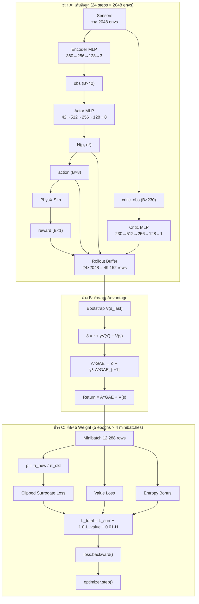

# Tron1 PPO Training: Numerical Walkthrough ทุกขั้นตอน

> **เอกสารต้นทาง (external source) — เก็บไว้เพื่ออ้างอิง ไม่ใช่โน้ตของชุดนี้**
>
> ไฟล์นี้สร้างโดย Gemini/antigravity (2026-09-09) และถูกใช้เป็นวัตถุดิบของโน้ต 05–07
> เนื้อหาที่ถูกต้องและอธิบายได้ดีถูกดูดเข้าไปในโน้ตชุดหลักแล้ว · **อย่าอ่านไฟล์นี้เป็น
> ความจริง** — มันมีข้อผิดพลาดที่ตรวจพบและแก้ในโน้ตชุดหลักแล้ว:
>
> | ในไฟล์นี้ | ค่าจริง (ตรวจกับโค้ด) | ที่ (เลขบรรทัดนับรวมหัวข้อนี้แล้ว) |
> | --- | --- | --- |
> | actor 185,480 พารามิเตอร์ | **187,272** (42→512→256→128→8) | l.662 |
> | critic 250,625 | **282,625** (230→512→256→128→1) | l.664 |
> | encoder ~129K | **125,699** (360→256→128→3) | l.706 |
> | รวม ~436,113 | **469,905** ใน optimizer หลัก (+ encoder แยก) | l.667 |
> | `log_prob[0] = −2.41` | ตัวเลขสมมติ — เวกเตอร์ $\varepsilon$ ของไฟล์นี้เองให้ **−2.47** | l.287, 543 |
> | V = 650, mean(A) = 15, std = 12, ρ = 1.25 | ตัวเลขสมมติ (เลขคณิตบนค่าเหล่านั้นถูก) | l.321, 486, 546 |
> | `log_prob` shape `(2048, 1)` | `(2048,)` — `.sum(dim=-1)` ตัดแกนสุดท้ายทิ้ง | l.293 |
> | `N(μ, σ²)` ใน mermaid | โน้ตชุดนี้เขียน `N(μ, σ)` ตาม `scale` ของ torch | l.49 |
> | "σ ≈ 0.3 ตอนท้าย" แล้ว "σ ≈ 0.5" ในหัวข้อเดียวกัน | ขัดกันเอง — โน้ตชุดหลักใช้ σ = 0.5 ตลอด | l.253, 261 |
> | เลขสมการ (3), (5), (6), (1b) | ระบบเลขของไฟล์นี้เอง — ตารางแปลงอยู่ในโน้ต 06 §2 | l.411, 418, 517, 671 |
>
> ส่วนที่ **ถูกต้องและถูกนำไปใช้**: การแตก policy_obs 36 = 3+3+8+8+8+2+4 (§1.1) ·
> ตารางเลเยอร์พร้อม shape ของ weight (§1.2, 1.4, 1.6) · ท่อ action → ×0.25 → PD
> (§1.7; kp = 45, kd = 1.5/0.8 ตรงกับ `solefoot_cfg.py:50-62`) · shape ของ buffer (§1.8) ·
> การไล่ GAE ย้อนหลังสามก้าว (§2.2) · ลำดับการคำนวณใน minibatch (§3) · ตาราง shape (§5) ·
> "ทำไมสมการ (1)(2)(3) หายไปตอน deploy" (§6)

---

> [!NOTE]
> เอกสารนี้ไล่ตาม **1 iteration** ของ `train.py` ตั้งแต่ต้นจนจบ แสดง **shape** (ขนาด tensor) และ **ตัวเลขจริง** ในทุกจุด
> ให้เห็นว่าข้อมูล "ยี่ห้ออะไร ขนาดเท่าไหร่" ไหลจากฟังก์ชันไหนไปฟังก์ชันไหน
>
> **สัญลักษณ์ shape:** `B = batch (จำนวน environment ขนาน)` เช่น `B = 2048`

---

## 0. สรุป Data Flow ทั้งหมดในภาพเดียว



---

## 1. ช่วง A: เก็บข้อมูล (Collection) — วน 24 รอบ

ทุก policy step ทำสิ่งต่อไปนี้กับ **ทุก environment พร้อมกัน (batch = 2048)**

### Step 1.1: อ่านเซนเซอร์ → สร้าง Observation Vectors

```text
เซนเซอร์จาก 2048 env รวมเป็น 3 ก้อน:
┌─────────────────────────────────────────────────────────────────┐
│ policy_obs   shape = (2048, 36)                                 │
│   base_ang_vel ........... 3 floats   (IMU angular velocity)    │
│   proj_gravity ........... 3 floats   (gravity direction)       │
│   joint_pos .............. 8 floats   (joint angles, rad)       │
│   joint_vel .............. 8 floats   (joint speeds, rad/s)     │
│   last_action ............ 8 floats   (previous action)         │
│   gait_phase ............. 2 floats   (sin/cos gait clock)      │
│   gait_command ........... 4 floats   (gait timing params)      │
├─────────────────────────────────────────────────────────────────┤
│ commands_obs shape = (2048, 3)                                  │
│   velocity_commands ...... 3 floats   (vx, vy, ωz targets)     │
├─────────────────────────────────────────────────────────────────┤
│ history_obs  shape = (2048, 360)                                │
│   policy_obs ย้อนหลัง 10 steps เรียงต่อกัน  (10 × 36 = 360)     │
├─────────────────────────────────────────────────────────────────┤
│ critic_obs   shape = (2048, 230)                                │
│   privileged observations 227 floats + commands 3 floats        │
│   (รวม base_lin_vel จริง, แรงสัมผัสเท้า, domain random params) │
└─────────────────────────────────────────────────────────────────┘
```

**ตัวอย่าง** สมมติ env ตัวที่ 0 ที่ step 5 ของ rollout:

| ข้อมูล | ตัวอย่างค่า | Shape per env |
|---|---|---|
| `policy_obs[0]` | `[0.02, -0.15, 0.01, 0.0, 0.0, -9.8, 0.12, -0.05, ...]` | `(36,)` |
| `commands_obs[0]` | `[0.5, 0.0, 0.0]` = "เดินตรง 0.5 m/s" | `(3,)` |
| `history_obs[0]` | `[obs_{t-9}, obs_{t-8}, ..., obs_{t}]` ต่อกัน | `(360,)` |
| `critic_obs[0]` | `[0.48, 0.01, 0.0, ...]` (รวม base_lin_vel จริง) | `(230,)` |

---

### Step 1.2: Encoder สร้าง Latent จากประวัติ

```text
history_obs (2048, 360)
      │
      ▼
┌──── Encoder MLP ────────────────────────────────────────────┐
│  Linear(360, 256)  → ELU   W₁∈ℝ^(256×360), b₁∈ℝ^(256)     │
│  Linear(256, 128)  → ELU   W₂∈ℝ^(128×256), b₂∈ℝ^(128)     │
│  Linear(128,   3)           W₃∈ℝ^(3×128),   b₃∈ℝ^(3)       │
└─────────────────────────────────────────────────────────────┘
      │
      ▼
latent (2048, 3)     ← "ค่าประมาณ base_lin_vel (vx, vy, vz)"
```

**คำนวณจริง (env 0):**

```text
h₁ = ELU( W₁ · history_obs[0] + b₁ )    → vector ยาว 256
h₂ = ELU( W₂ · h₁ + b₂ )                → vector ยาว 128
latent[0] = W₃ · h₂ + b₃                 → [0.47, 0.02, -0.01]
                                             ≈ base_lin_vel จริง [0.48, 0.01, 0.0]
```

> [!TIP]
> Encoder ถูกฝึกแยกด้วย MSE loss: `loss_enc = MSE(latent, critic_obs[:, 0:3])`
> เป้าหมายคือให้ `latent ≈ base_lin_vel จริง` โดยใช้แค่ข้อมูลที่เซนเซอร์จริงวัดได้

---

### Step 1.3: ต่อ input เข้าด้วยกัน → Actor Input

```text
actor_input = concat([ latent,    policy_obs, commands_obs ])
                       (2048,3)    (2048,36)    (2048,3)
            =  (2048, 42)
```

**env 0:**
```text
actor_input[0] = [0.47, 0.02, -0.01,       ← latent (3)
                  0.02, -0.15, 0.01, ...,   ← policy_obs (36)
                  0.5, 0.0, 0.0 ]           ← commands (3)
                 ─────────────────
                 รวม 42 ตัวเลข
```

---

### Step 1.4: Actor MLP คำนวณ μ (Mean Action)

```text
actor_input (2048, 42)
      │
      ▼
┌──── Actor MLP ──────────────────────────────────────────────┐
│  Layer 1:  z₁ = ELU( W₁·x + b₁ )                           │
│            W₁ ∈ ℝ^(512×42), b₁ ∈ ℝ^(512)                   │
│            x ∈ ℝ^(42)  →  z₁ ∈ ℝ^(512)                     │
│            คูณ matrix: 42 ตัวเลข → 512 ตัวเลข               │
│                                                              │
│  Layer 2:  z₂ = ELU( W₂·z₁ + b₂ )                           │
│            W₂ ∈ ℝ^(256×512), b₂ ∈ ℝ^(256)                   │
│            512 ตัวเลข → 256 ตัวเลข                           │
│                                                              │
│  Layer 3:  z₃ = ELU( W₃·z₂ + b₃ )                           │
│            W₃ ∈ ℝ^(128×256), b₃ ∈ ℝ^(128)                   │
│            256 ตัวเลข → 128 ตัวเลข                           │
│                                                              │
│  Output:   μ = W₄·z₃ + b₄                                   │
│            W₄ ∈ ℝ^(8×128), b₄ ∈ ℝ^(8)                      │
│            128 ตัวเลข → 8 ตัวเลข (ไม่มี activation)         │
└─────────────────────────────────────────────────────────────┘
      │
      ▼
μ (2048, 8)   ← ค่าเฉลี่ยของ action แต่ละข้อต่อ
```

**คำนวณเป็นตัวเลข (env 0):**

```text
x = actor_input[0]     → 42 ตัวเลข

z₁ = ELU( W₁ · x + b₁ )
      ↓
   W₁·x = [21504 multiplications + 512 additions]
         = raw vector ∈ ℝ^512
   + b₁  = [+bias 512 ค่า]
   ELU   = ถ้า > 0 ใช้ค่าเดิม, ถ้า < 0 ใช้ eˣ-1
         → z₁ = [0.32, -0.01, 0.77, 0.0, ..., 0.55]  (512 ค่า)

z₂ = ELU( W₂ · z₁ + b₂ )
         → z₂ = [0.15, 0.41, ..., -0.02]  (256 ค่า)

z₃ = ELU( W₃ · z₂ + b₃ )
         → z₃ = [0.61, 0.03, ..., 0.28]   (128 ค่า)

μ = W₄ · z₃ + b₄
  → μ[0] = [0.42, -0.31, 0.15, 0.08, -0.42, 0.29, -0.18, 0.05]
             ──────────────────────────────────────────────────
             abad_L  hip_L  knee_L ankle_L abad_R  hip_R knee_R ankle_R
             (8 ค่า = 8 ข้อต่อ)
```

> [!IMPORTANT]
> **ตรงนี้คือแค่ "ค่าที่ดีที่สุดที่ actor คิดว่าควรทำ"** ยังไม่ใช่ action สุดท้าย

---

### Step 1.5: สร้าง Gaussian Distribution แล้วสุ่ม Action

```text
σ = exp(logstd)     ← logstd เป็น learnable parameter, shape (8,)
                       เริ่มต้น logstd = [0,0,0,0,0,0,0,0]
                       → σ = [1.0, 1.0, 1.0, 1.0, 1.0, 1.0, 1.0, 1.0]
                       (ระหว่างเทรน σ จะค่อยๆ ลดลง เช่น ≈ 0.3 ตอนท้าย)

distribution = Normal(μ, σ)     ← Gaussian 8 มิติ (แต่ละข้อต่อเป็นอิสระ)

action = μ + σ ⊙ ε             ← ε ~ Normal(0, 1), shape (2048, 8)
                                   ⊙ = คูณทีละตัว (element-wise)
```

**คำนวณเป็นตัวเลข (env 0):** สมมติ σ ≈ 0.5 (ฝึกไปสักพัก)

```text
μ[0]  = [  0.42, -0.31,  0.15,  0.08, -0.42,  0.29, -0.18,  0.05]
σ     = [  0.50,  0.50,  0.50,  0.50,  0.50,  0.50,  0.50,  0.50]
ε[0]  = [  0.38, -0.12,  0.55, -0.20,  0.10,  0.72, -0.45,  0.31]  ← สุ่ม

a[0]  = μ + σ⊙ε
      = [  0.42+0.19, -0.31-0.06, 0.15+0.28, 0.08-0.10,
         -0.42+0.05,  0.29+0.36, -0.18-0.23, 0.05+0.16]
      = [  0.61, -0.37,  0.43, -0.02, -0.37,  0.65, -0.41,  0.21]
         ──────────────────────────────────────────────────────────
         8 floats ไม่มีหน่วย (ยังไม่คูณ scale)
```

**คำนวณ log probability ที่จะใช้ทำ PPO ในภายหลัง:**

$$\log \pi(a \mid s) = \sum_{j=1}^{8} \left( -\frac{1}{2}\ln(2\pi) - \ln \sigma_j - \frac{(a_j - \mu_j)^2}{2\sigma_j^2} \right)$$

```text
สำหรับข้อต่อแรก (abad_L):
  = -0.5·ln(2π) - ln(0.5) - (0.61-0.42)² / (2·0.5²)
  = -0.919 - (-0.693) - 0.19² / 0.5
  = -0.919 + 0.693 - 0.072
  = -0.298

รวมทั้ง 8 ข้อต่อ: log_prob[0] = Σ = -2.41   ← scalar 1 ค่าต่อ env
```

```text
Shape สรุป:
  action    = (2048, 8)     ← 8 floats per env
  log_prob  = (2048, 1)     ← 1 scalar per env (ผลรวม log prob ทั้ง 8 ข้อต่อ)
```

---

### Step 1.6: Critic MLP คำนวณ V(s)

```text
critic_obs (2048, 230)
      │
      ▼
┌──── Critic MLP ─────────────────────────────────────────────┐
│  Layer 1:  h₁ = ELU( W₁·x + b₁ )   W₁ ∈ ℝ^(512×230)       │
│            230 → 512                                         │
│  Layer 2:  h₂ = ELU( W₂·h₁ + b₂ )  W₂ ∈ ℝ^(256×512)       │
│            512 → 256                                         │
│  Layer 3:  h₃ = ELU( W₃·h₂ + b₃ )  W₃ ∈ ℝ^(128×256)       │
│            256 → 128                                         │
│  Output:   V = W₄·h₃ + b₄          W₄ ∈ ℝ^(1×128)          │
│            128 → 1 (scalar)                                  │
└─────────────────────────────────────────────────────────────┘
      │
      ▼
V(s) (2048, 1)   ← "คะแนนที่คาดว่าจะสะสมได้จากจุดนี้จนจบ"
```

**env 0:**
```text
V(s₀)[0] = 650.0   ← critic ทำนายว่า "จากท่านี้ น่าจะเก็บได้อีก 650 แต้ม"
```

---

### Step 1.7: ส่ง Action เข้า Simulation → ได้ Reward

```text
action (2048, 8)
   │
   ├── × scale 0.25          → (2048, 8)  ← ลดขนาดจากตัวเลข ±1 เป็น ±0.25 rad
   ├── + default_joint_pos   → (2048, 8)  ← บวก offset (= 0.0 ทุกข้อใน Tron1 SF)
   │
   ▼
joint_position_target (2048, 8)
   │
   ▼ PhysX PD Controller: τ = kp·(target − current) − kd·velocity
   │   kp = 45.0, kd = 1.5 (legs) / 0.8 (ankles)
   │   ทำงานที่ 200 Hz (4 substeps per policy step)
   │
   ▼
env.step() → ฟิสิกส์ขยับ → ได้ output:
   ┌─────────────────────────────────────────────────────┐
   │  reward     (2048, 1)   ← ผลรวม 20 reward terms     │
   │  next_obs   (2048, 36)  ← state ใหม่หลังขยับ         │
   │  done       (2048, 1)   ← True ถ้าล้มหรือหมดเวลา    │
   │  time_out   (2048, 1)   ← True ถ้าจบเพราะหมดเวลา    │
   └─────────────────────────────────────────────────────┘
```

**env 0:**
```text
action[0]         = [0.61, -0.37, 0.43, ...] (ไม่มีหน่วย)
× 0.25            = [0.153, -0.093, 0.108, ...] (rad)
+ default (0.0)   = [0.153, -0.093, 0.108, ...] (rad) → ส่งให้ PD

reward[0] = +0.72   (ผลรวม: ทรงตัวดี +0.8, เท้ากระแทก -0.1, ...)
done[0]   = False    (ยังไม่ล้ม ยังไม่หมดเวลา)
```

---

### Step 1.8: เก็บทุกอย่างลง Buffer

ทำซ้ำ Step 1.1–1.7 จำนวน **24 รอบ** เก็บทุก transition ลง rollout buffer:

```text
Rollout Buffer หลังเก็บครบ 24 steps:
┌─────────────────────────────────────────────────────────────────────┐
│  obs          shape = (24, 2048, 42)     ← actor input ทุก step     │
│  critic_obs   shape = (24, 2048, 230)    ← critic input ทุก step    │
│  actions      shape = (24, 2048, 8)      ← action ที่สุ่มได้          │
│  rewards      shape = (24, 2048, 1)      ← reward ที่ได้รับ          │
│  dones        shape = (24, 2048, 1)      ← จบ episode หรือยัง       │
│  values       shape = (24, 2048, 1)      ← V(s) จาก critic          │
│  log_probs    shape = (24, 2048, 1)      ← log π_old(a|s) ณ ตอนเก็บ │
│  mu           shape = (24, 2048, 8)      ← μ ณ ตอนเก็บ              │
│  sigma        shape = (24, 2048, 8)      ← σ ณ ตอนเก็บ              │
└─────────────────────────────────────────────────────────────────────┘

จำนวน transition ทั้งหมด = 24 × 2048 = 49,152
```

---

## 2. ช่วง B: คำนวณ Advantage ด้วย GAE

### Step 2.1: Bootstrap — ให้ Critic ทำนายค่าที่ step สุดท้าย

เพราะ rollout ถูกตัดที่ 24 steps (ไม่ใช่จบ episode) ต้องให้ Critic ทำนายค่า "ส่วนที่เหลือ":

```text
V_last = critic(obs_at_step_24)    shape = (2048, 1)
       = [682.3, 540.1, 712.8, ...]   ← ค่าทำนายของ state สุดท้าย
```

### Step 2.2: ไล่ย้อนกลับ step 23 → step 0 คำนวณ δ และ A^GAE

**γ = 0.99, λ = 0.95**

```text
เริ่มจาก A_last = 0  (เริ่มต้น advantage ที่ step สุดท้าย)

FOR t = 23, 22, 21, ..., 1, 0:   ← ไล่ย้อนจากหลังมาหน้า

   not_done[t] = 1.0 − dones[t]        shape = (2048, 1)

   next_value  = V_last                 ถ้า t = 23
               = values[t+1]            ถ้า t < 23

   ┌─── สมการ Bellman (สมการ 3) ───────────────────────┐
   │ δ[t] = rewards[t] + not_done · γ · next_value      │
   │                  − values[t]                        │
   │                                                     │
   │ = "สิ่งที่เกิดจริง" − "สิ่งที่ critic เดาไว้"       │
   └─────────────────────────────────────────────────────┘

   ┌─── สมการ GAE (สมการ 5) ───────────────────────────┐
   │ A[t] = δ[t] + not_done · (γ·λ) · A[t+1]            │
   │                                                     │
   │ = TD error ก้าวนี้ + ส่วนสะสมจากก้าวถัดไป           │
   │   (ถ่วงน้ำหนักลดลงเรื่อยๆ ด้วย 0.99×0.95=0.9405)  │
   └─────────────────────────────────────────────────────┘

   return[t] = A[t] + values[t]         ← "target ที่ critic ควรทำนาย"
```

**ตัวเลขจริง (env 0, ไล่ย้อน 3 steps สุดท้าย):**

```text
สมมติ rewards, values, dones ของ env 0 ดังนี้:
  step 23: r=0.65,  V=648.0,  done=False,  next_V=V_last=682.3
  step 22: r=0.72,  V=650.0,  done=False,  next_V=V[23]=648.0
  step 21: r=0.58,  V=645.0,  done=False,  next_V=V[22]=650.0

── Step t=23 (ก้าวสุดท้าย ไล่ย้อนจากตรงนี้ก่อน) ──

  not_done = 1.0  (ไม่ล้ม)

  δ[23] = r[23] + γ · V_last − V[23]
        = 0.65 + 0.99 × 682.3 − 648.0
        = 0.65 + 675.5 − 648.0
        = 28.15

  A[23] = δ[23] + (γλ) · 0     ← A_last = 0 (เริ่มต้น)
        = 28.15

  return[23] = 28.15 + 648.0 = 676.15

── Step t=22 ──

  δ[22] = r[22] + γ · V[23] − V[22]
        = 0.72 + 0.99 × 648.0 − 650.0
        = 0.72 + 641.5 − 650.0
        = −7.78

  A[22] = δ[22] + (γλ) · A[23]
        = −7.78 + 0.9405 × 28.15
        = −7.78 + 26.48
        = 18.70

  return[22] = 18.70 + 650.0 = 668.70

── Step t=21 ──

  δ[21] = 0.58 + 0.99 × 650.0 − 645.0
        = 0.58 + 643.5 − 645.0
        = −0.92

  A[21] = −0.92 + 0.9405 × 18.70
        = −0.92 + 17.59
        = 16.67

  return[21] = 16.67 + 645.0 = 661.67
```

### Step 2.3: Normalize Advantage

```text
A_normalized = (A − mean(A)) / (std(A) + 1e-8)
               ─────────────────────────────────
               ทำกับ A ทั้ง 49,152 ค่าพร้อมกัน

shape: (24, 2048, 1) → (24, 2048, 1) (ค่าเดิม แค่ปรับ scale)

สมมติ mean(A)=15.0, std(A)=12.0:
  A_norm[23] = (28.15 − 15.0) / 12.0 = +1.10   ← "action ดีกว่าค่าเฉลี่ยมาก"
  A_norm[22] = (18.70 − 15.0) / 12.0 = +0.31   ← "ดีกว่าเฉลี่ยนิดหน่อย"
  A_norm[21] = (16.67 − 15.0) / 12.0 = +0.14   ← "ดีกว่าเฉลี่ยเล็กน้อย"
```

### ผลลัพธ์ช่วง B — ข้อมูลพร้อมสำหรับ PPO Update:

```text
advantages  shape = (24, 2048, 1)   ← A^GAE normalized
returns     shape = (24, 2048, 1)   ← target V ที่ critic ควรทำนาย
```

---

## 3. ช่วง C: อัปเดต Weight ด้วย PPO

### Step 3.0: Flatten buffer → แบ่ง minibatch

```text
ทุก tensor ถูก reshape จาก (24, 2048, ...) → (49152, ...)

แบ่งเป็น 4 minibatches (สลับลำดับแบบ random):
  minibatch 0: rows 0–12287      (12,288 transitions)
  minibatch 1: rows 12288–24575
  minibatch 2: rows 24576–36863
  minibatch 3: rows 36864–49151

วน 5 epochs × 4 minibatches = 20 gradient updates ต่อ iteration
```

### Step 3.1: คำนวณ ρ (Probability Ratio) — สมการ 6

สำหรับแต่ละ transition ใน minibatch:

```text
1. หยิบ action เดิมจาก buffer:  a_old = actions_batch[i]     shape (12288, 8)

2. ส่ง obs เดิมผ่าน Actor ตัวปัจจุบัน (weight อาจเปลี่ยนไปแล้ว):
   μ_new, σ_new = actor(obs_batch[i])

3. คำนวณ log prob ใหม่ กับ action เดิม:
   log_prob_new = Σⱼ (−½ln(2π) − ln(σ_new_j) − (a_old_j − μ_new_j)² / (2σ_new_j²))
                  shape = (12288, 1)

4. ดึง log prob เก่าจาก buffer:
   log_prob_old = old_log_probs_batch[i]
                  shape = (12288, 1)

5. คำนวณ ratio:
   ρ = exp(log_prob_new − log_prob_old)
     shape = (12288, 1)
```

**ตัวเลข (transition ตัวที่ 0 ใน minibatch):**

```text
log_prob_old = −2.41  (เก็บไว้จากช่วง A)
log_prob_new = −2.19  (คำนวณใหม่จาก actor ที่ weight เปลี่ยนไปแล้ว)

ρ = exp(−2.19 − (−2.41)) = exp(0.22) = 1.25

ความหมาย: "actor ตัวใหม่อยากทำ action นี้ มากขึ้น 25% เมื่อเทียบกับตอนเก็บข้อมูล"
```

### Step 3.2: Clipped Surrogate Loss

```text
A_norm = advantages_batch   shape = (12288, 1)

surr1          = −ρ · A_norm
surr2_clipped  = −clip(ρ, 0.8, 1.2) · A_norm      ← ε = 0.2

L_surrogate    = mean( max(surr1, surr2_clipped) )  ← scalar 1 ค่า
```

**ตัวเลข (transition 0):**

```text
A_norm = +1.10  (action ดีกว่าเฉลี่ย)
ρ      = 1.25

surr1  = −1.25 × 1.10 = −1.375
                               ← ถ้าปล่อย: จะให้รางวัลมาก

clip(1.25, 0.8, 1.2) = 1.2    ← เกิน! ถูก clip ลงมาที่ 1.2

surr2  = −1.2 × 1.10 = −1.320
                               ← ถูกจำกัดแรงจูงใจ

L_surr(ตัวนี้) = max(−1.375, −1.320) = −1.320
                                         ← PPO เลือกค่าที่ "ให้รางวัลน้อยกว่า"
                                            = ป้องกันไม่ให้ actor เปลี่ยนเร็วเกินไป
```

> [!WARNING]
> **นี่คือหัวใจของ PPO:** ρ = 1.25 (เปลี่ยน 25%) เกินกว่า 1+ε = 1.2 (ขีดจำกัด 20%)
> → PPO หยุดให้รางวัลกับการเปลี่ยนเกินจุดนี้ → actor ถูกบังคับให้เปลี่ยนทีละน้อย

### Step 3.3: Value Loss — สอน Critic ให้ทำนายแม่นขึ้น

```text
V_new      = critic(critic_obs_batch)   shape = (12288, 1)  ← ค่าทำนายใหม่
V_old      = old_values_batch           shape = (12288, 1)  ← ค่าทำนายเก่า
target     = returns_batch              shape = (12288, 1)  ← "คำตอบที่ถูก" จาก GAE

V_clipped  = V_old + clip(V_new − V_old, −0.2, +0.2)

loss_v1    = (V_new − target)²
loss_v2    = (V_clipped − target)²

L_value    = mean( max(loss_v1, loss_v2) )    ← scalar 1 ค่า
```

**ตัวเลข (transition 0):**

```text
V_old  = 648.0    (critic เก่าทำนายไว้)
V_new  = 660.0    (critic ปัจจุบันทำนาย)
target = 676.15   (ค่าจริงจาก GAE)

loss_v1 = (660.0 − 676.15)² = 259.6
loss_v2:
  V_clipped = 648.0 + clip(660-648, -0.2, 0.2)
            = 648.0 + 0.2  = 648.2   ← clip แรง เพราะ +12 เกิน 0.2 มาก
  loss_v2   = (648.2 − 676.15)² = 781.2

L_value(ตัวนี้) = max(259.6, 781.2) = 781.2
```

### Step 3.4: Entropy Bonus — กันไม่ให้ "มั่นใจเกินไป"

```text
Gaussian entropy สำหรับ 8 ข้อต่อ:

H = Σⱼ₌₁⁸ ( ½ + ½·ln(2π) + ln(σⱼ) )

shape: (12288,) → mean → scalar 1 ค่า
```

**ตัวเลข:**

```text
σ = [0.50, 0.50, 0.50, 0.50, 0.50, 0.50, 0.50, 0.50]

H_per_joint = 0.5 + 0.5·ln(2π) + ln(0.5)
            = 0.5 + 0.919 + (−0.693)
            = 0.726

H_total = 8 × 0.726 = 5.81
```

### Step 3.5: รวม Loss ทั้งหมด → Backprop → Update Weight

```text
┌─────────────────────────────────────────────────────────────────┐
│                                                                 │
│  L_total = L_surrogate + 1.0 · L_value − 0.01 · H              │
│                                                                 │
│          = (−1.32)   + 1.0 × 781.2   − 0.01 × 5.81             │
│          = −1.32 + 781.2 − 0.058                                │
│          = 779.82     ← (ค่าจริงจะเป็น mean ของทั้ง minibatch)  │
│                                                                 │
│  สัญลักษณ์:                                                      │
│    + L_surrogate  → ดัน actor ให้เลือก action ที่ดี               │
│    + L_value      → สอน critic ให้ทำนายแม่นขึ้น                  │
│    − H            → ให้โบนัส เมื่อ σ ยังใหญ่ (ยังสำรวจอยู่)      │
│                                                                 │
└─────────────────────────────────────────────────────────────────┘
         │
         ▼
loss.backward()    ← PyTorch คำนวณ ∂L/∂θ สำหรับ weight ทุกตัว
                      ใน actor, critic, และ logstd
                      ด้วย backpropagation (chain rule)
                      ผลลัพธ์ = gradient vector ขนาดเท่าจำนวน weight ทั้งหมด:
                      actor:   42×512 + 512 + 512×256 + 256 +
                               256×128 + 128 + 128×8 + 8    = 185,480 ค่า
                      critic:  230×512 + 512 + 512×256 + 256 +
                               256×128 + 128 + 128×1 + 1    = 250,625 ค่า
                      logstd:  8 ค่า
                      ─────────────────────────────
                      รวม ~436,113 partial derivatives

clip_grad_norm_(params, max_norm=1.0)  ← ป้องกัน gradient ระเบิด

optimizer.step()   ← ทำสมการ (1b): θ ← θ − α · ∇L
                      ปรับ weight ทุกตัวพร้อมกัน
                      α = learning rate (เริ่ม 1e-3, ปรับตาม KL)
```

### Step 3.6: KL Adaptive Learning Rate

```text
หลัง update ทุกรอบ วัด KL divergence:

KL = mean over batch of:
     Σⱼ₌₁⁸ ( ln(σ_new_j/σ_old_j) + (σ_old_j² + (μ_old_j − μ_new_j)²)/(2σ_new_j²) − ½ )

desired_kl = 0.01

ถ้า KL > 2 × 0.01 = 0.02:   lr ← max(1e-5, lr / 1.5)   "ช้าลง!"
ถ้า KL < 0.5 × 0.01 = 0.005: lr ← min(1e-2, lr × 1.5)   "เร็วขึ้นได้!"
```

---

## 4. สรุปผลลัพธ์ 1 Iteration

```text
┌── สิ่งที่เกิดขึ้น ────────────────────────────────────────────────┐
│                                                                   │
│  ✅ เก็บข้อมูล 24 steps × 2048 envs = 49,152 transitions          │
│  ✅ คำนวณ advantage ด้วย GAE (ย้อนจาก step 23 → 0)                │
│  ✅ อัปเดต weight 20 ครั้ง (5 epochs × 4 minibatches)             │
│  ✅ ปรับ learning rate ตาม KL divergence                          │
│                                                                   │
│  Weight ที่เปลี่ยน:                                                │
│    • Actor MLP       ~185K parameters   ← ตัดสินใจดีขึ้น          │
│    • Critic MLP      ~250K parameters   ← ทำนายแม่นขึ้น          │
│    • logstd          8 parameters       ← σ ค่อยๆ ลดลง           │
│    • Encoder MLP     ~129K parameters   ← ประมาณ vel ดีขึ้น       │
│                                                                   │
│  → ทำซ้ำอีก 14,999 iterations จนครบ 15,000                       │
│  → บันทึก model_15000.pt                                         │
│  → เอาเฉพาะ Actor + Encoder ไป export เป็น policy.onnx           │
│  → Critic, logstd, reward function, γ ← ⚠ ถูกทิ้งทั้งหมด        │
│                                                                   │
└───────────────────────────────────────────────────────────────────┘
```

---

## 5. Data Type & Shape Cheat Sheet

| ข้อมูล | Type | Shape | ใช้ตอนไหน |
|---|---|---|---|
| `policy_obs` | `float32` tensor | `(B, 36)` | เก็บข้อมูล + อัปเดต |
| `commands_obs` | `float32` tensor | `(B, 3)` | เก็บข้อมูล + อัปเดต |
| `history_obs` | `float32` tensor | `(B, 360)` | เก็บข้อมูล |
| `critic_obs` | `float32` tensor | `(B, 230)` | เก็บข้อมูล + อัปเดต |
| `actor_input` | `float32` tensor | `(B, 42)` | เก็บข้อมูล + อัปเดต |
| `μ` (mean action) | `float32` tensor | `(B, 8)` | เก็บข้อมูล |
| `σ` (std dev) | `float32` tensor | `(8,)` broadcast → `(B, 8)` | เก็บข้อมูล + อัปเดต |
| `action` | `float32` tensor | `(B, 8)` | เก็บข้อมูล + ส่งให้ sim |
| `log_prob` | `float32` tensor | `(B, 1)` | เก็บข้อมูล + PPO ratio |
| `V(s)` | `float32` tensor | `(B, 1)` | เก็บข้อมูล + GAE + value loss |
| `reward` | `float32` tensor | `(B, 1)` | เก็บข้อมูล + GAE |
| `done` | `bool` tensor | `(B, 1)` | เก็บข้อมูล + GAE |
| `advantage` | `float32` tensor | `(B, 1)` | PPO surrogate loss |
| `return` | `float32` tensor | `(B, 1)` | value loss target |
| `ρ` (ratio) | `float32` tensor | `(MB, 1)` | PPO clipping |
| `L_total` | `float32` scalar | `(1,)` | backprop |
| `gradient` | `float32` tensors | ~436K params total | optimizer.step |
| `latent` | `float32` tensor | `(B, 3)` | ต่อเข้า actor input |

> `B` = num_envs (2048), `MB` = minibatch size (12,288)

---

## 6. ทำไมสมการ 1, 2, 3 หายไปตอน Deploy

| สมการ | ทำอะไรตอนเทรน | ตอน Deploy |
|---|---|---|
| **(1)** $\pi^* = \arg\max \mathbb{E}[\sum \gamma^t r_t]$ | เป้าหมายทั้งหมด — gradient descent พยายามไต่เข้าหาคำตอบนี้ | **ไม่ใช้** — เป้าหมายบรรลุแล้ว (อยู่ใน weight ของ actor) |
| **(2)** $V(s) = \mathbb{E}[\sum \gamma^k r_{t+k}]$ | Critic ทำนายคะแนนสะสมเพื่อคำนวณ advantage | **ทิ้ง** — Critic ถูกลบออกจาก `.onnx` |
| **(3)** $V(s) = \mathbb{E}[r + \gamma V(s')]$ | Bellman equation ใช้คำนวณ TD error (δ) ใน GAE | **ทิ้ง** — ไม่ต้องคำนวณ TD error อีก |

**สิ่งเดียวที่เหลือบนหุ่นยนต์จริง:**

```text
เซนเซอร์ → [history] → Encoder(360→3) → concat(3+36+3=42) → Actor(42→8) → × 0.25 → มอเตอร์
           ↑                                                      ↑
     ไม่ใช้สมการอะไรเลย                                      ไม่ใช้สมการอะไรเลย
     แค่ matrix multiply + ELU ซ้ำ 4 ชั้น                    แค่ matrix multiply + ELU ซ้ำ 4 ชั้น
```

> [!TIP]
> **ทุกสมการ ทุก loss ทุก gradient ถูก "อบ" เข้าไปใน weight ของ Actor แล้ว**
> ตอน deploy ไม่ต้องรู้จัก γ, reward, Bellman, PPO เลยแม้แต่น้อย
> แค่คูณ matrix แล้ว ELU ซ้ำ 4 ชั้น ที่ 50 Hz ก็จบ
